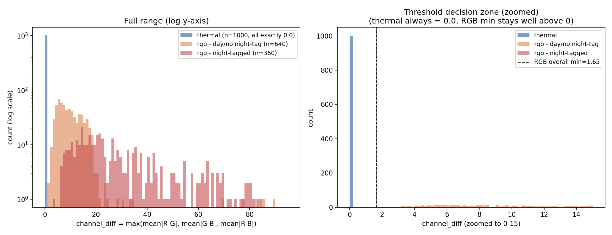

# 「用像素通道差異自動判斷 thermal vs RGB」構想驗證

範圍:純驗證,沒有動`app.py`或任何正式部署程式碼。這份報告只回答「這個方法準不
準」,整不整合、怎麼整合是下一步的事,這次沒有做建議。

## 先講一個改變分析重點的發現

抽第一批thermal圖片時就發現:thermal圖片存檔時**本來就是PIL mode='L'的單通道
灰階JPEG**,不是「三通道但R/G/B數值幾乎相同」。這跟原本的假設(熱像顯示圖片
本質上是灰階,只是存成3通道)不完全一樣——它連3通道都不是,檔案格式層級就只有
1個通道。

這件事已經用**全量掃描**驗證過(不是抽樣猜的):

| split | 圖片總數 | PIL mode |
|---|---:|---|
| images_thermal_train | 10742 | **100% 'L'** |
| images_thermal_val | 1144 | **100% 'L'** |
| images_rgb_train | 10319 | **100% 'RGB'** |
| images_rgb_val | 1085 | **100% 'RGB'** |

thermal這邊完全沒有反例(沒有意外混進彩色/3通道的熱像圖),RGB這邊也完全沒有
反例(沒有意外存成單通道的RGB照片)。這代表:只要把thermal圖片用`.convert("RGB")`
強制轉成3通道再算通道差異,三個通道的值會是**完全複製**過來的同一個數字,
`channel_diff`一定精確等於**0.0**,不是「接近0」——這是檔案格式的必然結果,
不是統計上的傾向。

## 1. 抽樣與量測方法

- 每個split(thermal train/val、rgb train/val)各抽500張,共2000張,
  `random.seed(1337)`。
- 指標用user提供的寫法:`channel_diff = max(mean|R-G|, mean|G-B|, mean|R-B|)`,
  圖片先`.convert("RGB")`再算。
- RGB的夜間子集合用**兩種獨立方法**交叉標記:
  1. `index.json`裡video-level的人工標記`"night"` tag(主要依據)
  2. 全圖平均亮度最暗15%(獨立於tag的第二個判定法,用來抓可能沒被標"night"
     但實際偏暗的影片,例如隧道/黃昏)
  - 兩者重疊(night-tag且屬於最暗15%)有139張,不是完全同一批,但高度相關。

## 2. 分布統計

| 群組 | n | mean | median | min | p1 | p5 | max |
|---|---:|---:|---:|---:|---:|---:|---:|
| thermal(全部) | 1000 | 0.0000 | 0.0000 | **0.0000** | 0.0000 | 0.0000 | 0.0000 |
| rgb(全部) | 1000 | 17.16 | 12.48 | **1.65** | 2.98 | 4.19 | 89.39 |
| rgb(night-tag) | 360 | 29.14 | 22.70 | 3.90 | 6.89 | 8.76 | 84.99 |
| rgb(day/無tag) | 640 | 10.43 | 9.06 | 1.65 | 2.76 | 3.65 | 89.39 |
| rgb(最暗15%亮度) | 150 | 20.52 | 17.39 | 3.43 | 4.31 | 7.16 | 63.71 |

視覺化(左:全範圍log-y軸;右:放大0~15範圍看門檻決策區):

**意外但清楚的發現:夜間RGB的channel_diff不是變小、反而比白天RGB更大**
(night-tag mean 29.14 vs day mean 10.43)。這跟原本擔心的「夜間畫面色彩
飽和度低,可能被誤判成thermal」方向相反——推測是夜間畫面常有路燈、車燈、
紅綠燈等局部強烈色偏光源,加上低光source本身雜訊/色偏更明顯,反而拉高了
通道間差異,不是壓低它。這是實測結果,不是預期,如實記錄。

## 3. 門檻與混淆矩陣

thermal的`channel_diff`最大值 = **0.0**;RGB(全部1000張,含night跟最暗15%
子集)的最小值 = **1.6519**。兩者之間有清楚間隙,門檻設在**0.0001到1.65之間
任何值**,在這批2000張抽樣裡都能達到100%準確率:

| threshold | thermal→rgb誤判 | rgb→thermal誤判 | 其中night誤判 | 整體準確率 |
|---:|---:|---:|---:|---:|
| 0.001 ~ 1.6 | 0 / 1000 | 0 / 1000 | 0 / 360 | **100.00%** |
| 5.0 | 0 / 1000 | 95 / 1000 | 1 / 360 | 95.25% |
| 10.0 | 0 / 1000 | 390 / 1000 | 28 / 360 | 80.50% |

**在門檻設得夠低(<1.65)的情況下,這2000張抽樣裡沒有任何一張誤判,包括
夜間RGB子集合。** 門檻拉高才會開始把RGB誤判成thermal(而且如上所述,夜間
反而不是最容易被誤判的族群,是相對安全的)。

## 4. 誠實的結論

**在這個資料集內部,這個方法本身是可靠的**——不是「大致可靠」,是在抽樣的
2000張裡0誤判,而且夜間RGB(原本最擔心的邊界案例)實測反而比白天RGB更容易
分辨,不是更難。thermal這邊也完全沒有反例(全量掃描過,0張色彩異常)。

但有一個**重要的範圍限制,不是「這個方法不準」,是「這個方法測的是什麼」**:

這次驗證的其實是「**這個資料集的檔案儲存慣例**」(thermal存成單通道JPEG、
RGB存成三通道JPEG),不是「**畫面內容本質上是不是灰階**」這個更廣義的問題。
這兩件事在這個資料集裡完全等價,但如果之後demo收到的是使用者上傳、來源不明
的圖片,而不是這個資料集本身的圖片,這個等價關係不一定成立,例如:

- 使用者如果把一張thermal圖片先用某個工具編輯/截圖過,存檔時被強制轉成
  3通道JPEG(單通道灰階內容,但檔案格式是RGB)——內容還是灰階,`channel_diff`
  應該還是接近0(3個通道複製自同一個灰階值,JPEG壓縮可能引入極小的通道間
  雜訊,但這次測試沒有覆蓋這種「內容灰階但格式3通道」的情況,因為資料集裡
  沒有這種檔案可以抽樣)
- 反過來,如果使用者上傳一張色彩已經被大幅降低飽和度、幾乎變黑白的RGB照片
  (不是這次資料集裡的night影片那種,是刻意去色的),`channel_diff`可能會
  比這次量到的RGB最小值1.65還低,這種案例這次抽樣也沒有覆蓋到

換句話說:**這次驗證證明的是「檔案格式差異可以100%分辨thermal vs RGB
(在這個資料集內)」,不是證明「畫面內容色彩豐富度可以100%分辨thermal vs
RGB(對任意輸入圖片)」**。如果之後demo的自動判斷只吃這個資料集本身的圖片
(例如demo展示用的固定範例圖),這個方法非常可靠;如果要處理使用者真的上傳
的、來源完全不可控的圖片,前面提到的邊界案例沒有實測資料,不能保證同樣的
100%準確率。

## 檔案

- `sample_and_measure.py` — 抽樣+量測(輸出`sampled_measurements.csv`,git不追蹤)
- `plot_distributions.py` — 畫分布圖(輸出`channel_diff_distribution.png`)
- `channel_diff_distribution.png` — 視覺化結果
