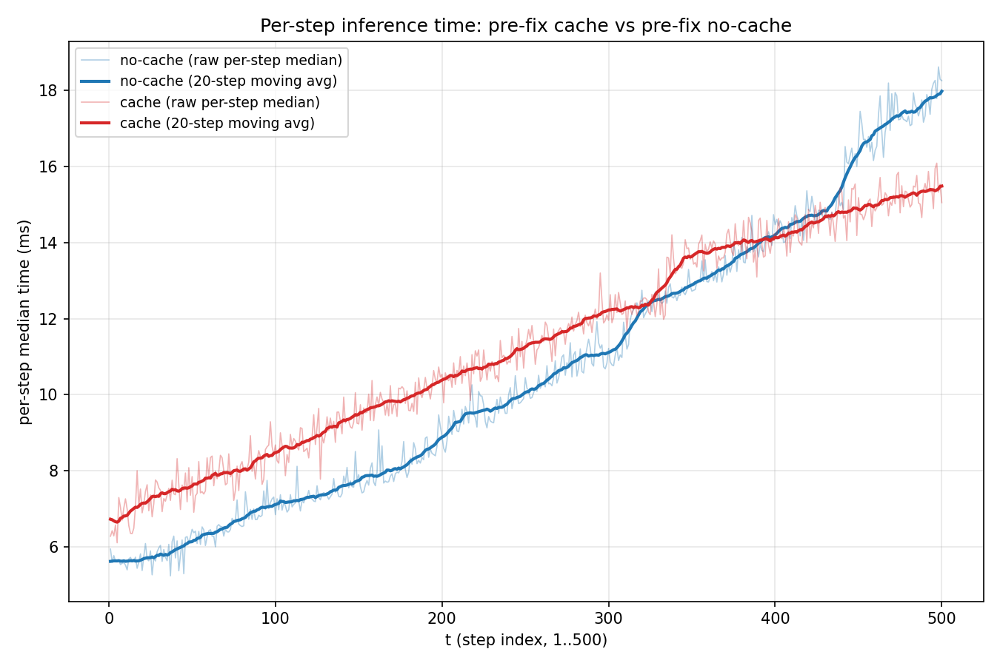
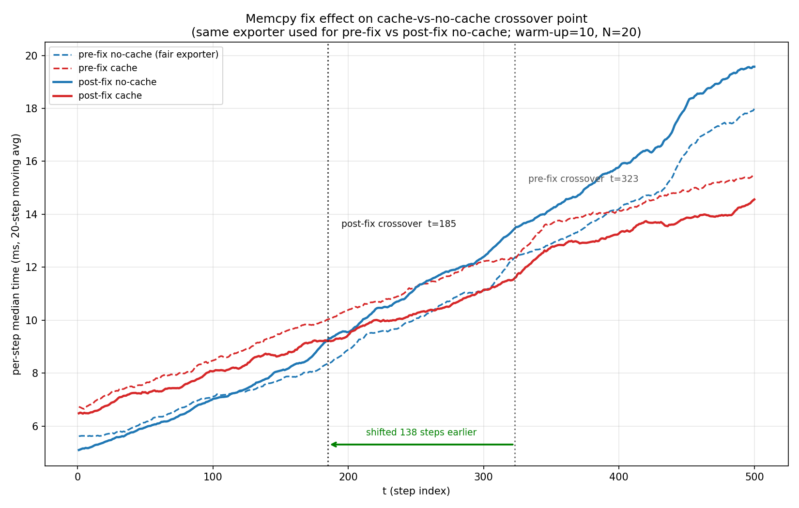

# GPT-2 在 ONNX 上做 KV-cache 的一次效能優化的完整記錄

## 前言

本篇是練習 GPT-2 和 KV cache 的實作，而考慮到在實際落地的推論環境，通常不是能跑 PyTorch 的環境，這也是我想把這次訓練好的 GPT-2 打包成 ONNX 的原因。不過打包的時候卻意外發現了換成 ONNX 的版本並沒有符合預期該有的加速效果。

最後仔細深究才發現，export 出來的計算圖卻比預計還多出了額外的 Memcpy 節點，因為不斷的在 CPU 和 GPU 之間反覆搬運資料，導致加速的時間也無法彌補搬運的時間。

本篇文主要是找出問題的起因並加以修復的過程，將多出來的 Memcpy 全數拿掉，並在最後 benchmark 的測試中縮短了之間的差距。過程中理解了 KV cache 划不划算其實跟序列長度有關，雖說拿掉的是不必要的搬運開銷，但 cache 本身 **省下的計算量隨序列變長而增加、額外開銷卻相對固定** 的這個特性沒有變，所以修復的效果是讓 cache 能實際加速的長度門檻下降了，但無法保證在任何情況下都比較快。


## 1. 為什麼需要 KV cache

### 自迴歸生成的重複計算問題
GPT-2 是 decoder-only Transformer，每次生成只吐一個新 token 以後，新的 token 就會被當作下一個輸入作使用，一直循環到生成完為止。這種生成方式稱為 **autoregressive generation**（自迴歸生成）。但這種方法用到的一個叫 Attention 的機制用來計算並記憶每個 token 的 feature，其中用到的 key $(k)$, value $(v)$ 的算式如下：

$$k_i = W_k \cdot \text{LayerNorm}(x_i), \quad v_i = W_v \cdot \text{LayerNorm}(x_i)$$

- $x_i = \text{tok\_emb}(t_i) + \text{pos\_emb}(i)$，是位置 $i$ 上 token $t_i$ 的輸入向量
- $W_k, W_v$ 是投影矩陣，**訓練完成後就凍結，推論時完全不變**
- $\text{tok\_emb}, \text{pos\_emb}$ 是查表運算，輸入 token id / 位置編號，永遠回傳同一個向量
- $\text{LayerNorm}$ 只依賴 $x_i$ 自己（**per-token 獨立、不跨 token 混合**）

由上述幾點可以得知，只要 token 還在同一個位置，不管在哪一步生成也不管後面接了什麼資料，
$k_i$ 和 $v_i$ 的值一定都會一樣。那當我們在算最新的第 $N$ 個 token 時，
$k_0, k_1, \ldots, k_{N-1}$ 和 $v_0, v_1, \ldots, v_{N-1}$ 就會是已知的。那解法就也很直觀了，透過將已知的 $k$ 和 $v$ 進行 cache 使得避免之後的重複運算，來達成加速的效果，這也就是 KV cache 這名字的由來。

實際上的做法也很簡單，生成兩個裝入 $K$ 和 $V$ 的 cache，每次計算新的 token $(N)$ 時，就把 $V_N$ 和 $K_N$ 接在 cache 的尾端，這樣就可以取得完整的 $k_0, k_1, \ldots, k_{N}$ 和 $v_0, v_1, \ldots, v_{N}$ 來用於 Attention 的計算。序列越長，加速的效果就會越明顯。

### export 成 ONNX 和 YOLO 的不同
ONNX 是什麼、跟 onnxruntime 的關係在上一篇的[《INT8 量化踩坑日誌》](https://medium.com/@x917205725/%E7%82%BA%E4%BB%80%E9%BA%BC-model-%E8%B6%8A%E5%A4%A7%E5%8F%8D%E8%80%8C%E8%B6%8A%E6%85%A2-%E5%BE%9E-ort-%E5%88%B0-modelopt-%E7%9A%84-int8-%E9%87%8F%E5%8C%96%E7%9A%84%E8%B8%A9%E5%9D%91%E6%97%A5%E8%AA%8C-6456acd4564e?postPublishedType=repub)
第 1 節有完整介紹，這篇就不多做重複。

前面有提到GPT-2是 **autoregressive generation**，這意味著在生成一個答案之前可能會經過好幾次的 forward，且每一次跑的迴圈次數都不相同。而 YOLO 只需要進行一次 forward 就可以生成答案。那這會有甚麼問題呢?上一篇文章有提到說，ONNX 會建立一個靜態的計算圖，這就表示無法固定迴圈次數的 **autoregressive generation** model 是無法生成的。解決方法也並不複雜，只需要將 forward 的邏輯改為單次的就好，用 Python 的迴圈來進行多次的呼叫。不過也因為這個只能走一步的性質，使 KV cache 的邏輯不能放入 model class 當中，必須被視為外部參數，將舊的 cache 丟給 model，model 則會把最新的 cache 回傳回主程式。這裡的設計細節會在後面進行補充。


## 2. GPU 上 cache 反而沒有比較快

### benchmark比較

具體到這篇的 benchmark，會對兩種版本做比較：

- **ONNX 無 cache**——經過 ONNX 但沒有 KV cache 機制
- **ONNX 有 cache**——經過 ONNX 且有 KV cache 機制

環境：RTX 4070、CUDA 12.6、onnxruntime-gpu 1.22.0、100 tokens 生成、median-of-10。

### benchmark 結果

| 版本 | median 耗時 | 相對無 cache |
|---|---|---|
| ONNX 無 cache（GPU） | 619.96 ms | 1x |
| ONNX 有 cache（GPU） | 829.47 ms | **0.75x，比無 cache 慢 25.3%** |

理論上，有 KV cache 感覺是要無腦加速的，少算了前面已經算過的 token，理論上應該更快才對。但實際
量出來的結果完全相反，加了 cache 之後反而比什麼都不做的 no-cache 版本還慢了 25%。

## 3. Memory-bound

要用來解釋 benchmark 的反直覺的情況，就要看 GPU 在運算的時候都在哪裡花比較多的時間。
GPU 做一次 forward 時，時間花在哪裡取決於 **算矩陣乘法的時間** 和 **把 weight 從 VRAM 搬到運算單元的時間** 。
不難看出就剛好分別對應到 **compute-bound** 和 **memory-bound**。

關鍵的地方在於，不管這一步要處理是 1 個 token 也好或 100 個 token 也罷，model 都必須完整的把全部的 weight 從 VRAM 搬出來用，所以這個時間是固定的。
這意味著 GPT-2 這種等級的模型，每一步能入的 token 數，遠遠不夠讓算矩陣運算的時間追上搬運 weight 的時間，**memory-bound** 也是現在每個 GPU 的通病。


這個理論預測可以將 token 數量調高就能看出來（RTX 4070，median-of-10）：

| T | ONNX 無 cache | ONNX 有 cache | cache 速度比較 |
|---|---|---|---|
| 100 | 619.96 ms | 829.47 ms | -25.3%（慢） |
| 300 | 2587.98 ms | 2760.99 ms | -6.3%（慢） |
| 500 | 5727.01 ms | 5449.22 ms | +5.1%（反超） |

一切看起來是這麼的美好，但是還有一個更根本的問題，那就是為甚麼一開始 cache 的速度是被 no-cache 反超的呢?


## 4. cache 的 concat 和 no-cache 的矩陣重算



從圖表中可以看到，在 T 還小的時候，都是 cache 花費較多的時間去執行 concat；但之後當 T 增大時，no-cache 不僅要重新計算整個 $QK^T$ 這個矩陣，還要在每一步重新生成 causal mask，這兩個成本加起來，使得花費的增幅比 cache 版本巨大，逐漸變成了 no-cache 比 cache 耗時，交叉點落在 t≈323 附近。

這其實跟前面理論上可以算出來的東西是同一件事。cache 版本每一步只算一個新 token，累加 T 步下來的運算量會是 $O(T^2)$ 而 no-cache 每一步要重算整個序列，所以會是 $O(T^3)$ 這裡看到的 per-step 曲線。cache 每一步只需要付出 Concat 這筆接近固定的代價，no-cache 每一步卻要付出隨 T 增長的矩陣重算 + mask 重建。這正是為什麼 T 一旦拉大，no-cache 的成本會用比 cache 快得多的速度追上並超車。

這也是為什麼真實的 LLM serving system（例如 vLLM）都要做 continuous batching，把多個使用者同時要生成的下一個 token 湊在一起算，把GPU真正用到滿，進而增加 Arithmetic Intensity。


## 5. 修改 Memcpy

雖然解釋了 T 較小會使 cache 沒有達到真正加速的效果，但是我並不滿足於此，我還深入解析了計算圖來看看其中有甚麼潛伏的運算危機。

ONNX Runtime 提供了兩個工具可以做到這件事：SessionOptions.enable_profiling，會把每一次 forward 裡每個 node 的執行時間記錄成一份 JSON；還有 SessionOptions.optimized_model_filepath，可以把 ORT 內部優化過（融合、常數折疊之後）的計算圖存成一個新的 ONNX 檔案，直接打開來看每個 node 的型別、輸入輸出。

```
MemcpyFromHost Memcpy_token_24 <- ['/gpt/h.0/attn/Sqrt_2_output_0']
MemcpyFromHost Memcpy_token_25 <- ['/gpt/h.1/attn/Sqrt_2_output_0']
...（其餘 10 層同樣模式，共 12 層）

MemcpyFromHost Memcpy_token_23 <- ['/gpt/Gather_output_0']
MemcpyFromHost Memcpy <- ['/gpt/Add_output_0']

MemcpyToHost Memcpy_token_36 <- ['unsqueeze_output_0_CUDAExecutionProvider']
MemcpyToHost Memcpy_token_37 <- ['unsqueeze_output_1_CUDAExecutionProvider']
MemcpyToHost Memcpy_token_38 <- ['unsqueeze_output_2_CUDAExecutionProvider']
```

| 來源 | cache 版本數量 | no-cache 版本數量 | 方向 |
|---|---|---|---|
| attention scale（Sqrt） | 12 | 0 | CPU → GPU |
| position embedding 索引（Gather、Add） | 2 | 0 | CPU → GPU |
| causal mask 切片索引（Unsqueeze → Slice） | 3 | 3 | GPU → CPU |

利用這些工具把 cache 和 no-cache 的 optimized graph 拿出來看，發現了 cache 比 no-cache 活生生多出 14 個獨有的 Memcpy，分別為 MemcpyFromHost (CPU to GPU) 和 MemcpyToHost (GPU to CPU)。這代表運算的路程跟我想像的不太一樣，我起初認為這個過程都是在 GPU 上運行的，前面有說過 memory-bound 的問題，這樣子的操作其實是不太希望發生的。

數量最多是在 attention 當中為了 scale 所生成的。GPT-2 預設的有 12 層 layers，這相當是每一層的 attention block 就會有一次的 memcpy。這時候我們就來稍微看一下 Attention 的公式和 [code](https://github.com/ScORpioET/ai-learning-log/blob/main/Phase1-nanoGPT/Day18/train_gpt2.py) 放在一起看：

$$\text{Attention}(Q, K, V) = \text{softmax}\left(\frac{QK^T}{\sqrt{d_k}}\right)V$$

```python
y = F.scaled_dot_product_attention(q, k, v, is_causal=True)
```

公式中有用到 sqrt 的地方就是 scale(${\sqrt{d_k}}$) 的部分，在 torch 中 Attention 的計算是只要給定 Q, K, V 就可以自動算出 scale 的值，但問題就恰恰好出現在這裡。雖然在我們眼中 scale 是一個永恆不變的常數，但這個 scale 是透過 **q.size(-1)** 算出來的，這個 q tensor 的 shape 是 **(B, T, self.n_head, C // self.n_head)** ，即使**C // self.n_head**(也就是 head_dim)永恆不變，但也會因為 T 是動態生成的常數，而讓 ONNX Runtime 把這個參數判斷成不能 **constant folding (常數摺疊)**。折疊失敗的參數則會留在 CPU 上執行，但算出來的結果馬上就要拿去 GPU 上的 $QK^T$ 相乘，這也是為甚麼會有這麼多的 Memcpy 出現。

改法其實也很簡單，只要告訴 torch 指定的 scale 這樣他就會將其視為靜態參數了。

```python
y = F.scaled_dot_product_attention(q, k, v, is_causal=True, scale=(self.n_embd // self.n_head) ** -0.5)
```

經過這個簡單的改動，cache 版本的速度確實有提升，兩個版本之間的差距也從 25.3% 縮小到 16.5%。

| 狀態 | no-cache median | cache median | cache 慢多少 |
|---|---|---|---|
| pre-fix | 619.96 ms | 829.47 ms | 25.3% |
| post-fix | 606.56 ms | 726.50 ms | 16.5% |




交叉點從 t≈323 變成 t≈185，提早了 138 步，可說是非常不錯的一個進步。


## 6. 心得 & 通用手法
這篇文提供了一些針對 model 轉成 ONNX 之後優化的一些思路，雖然結果有進步但目前還是改變不了 cache 的版本剛開始比 no-cache 版本還慢的這件事情，16.5% 的差距、t≈185 的交叉點都還在。不過現今 LLM 的序列長度也是日漸加深，KV cache 在大部分時間仍然是個划算的選擇，而且這個划算的門檻，會隨著你把周邊的效率問題修掉而不斷往前移。