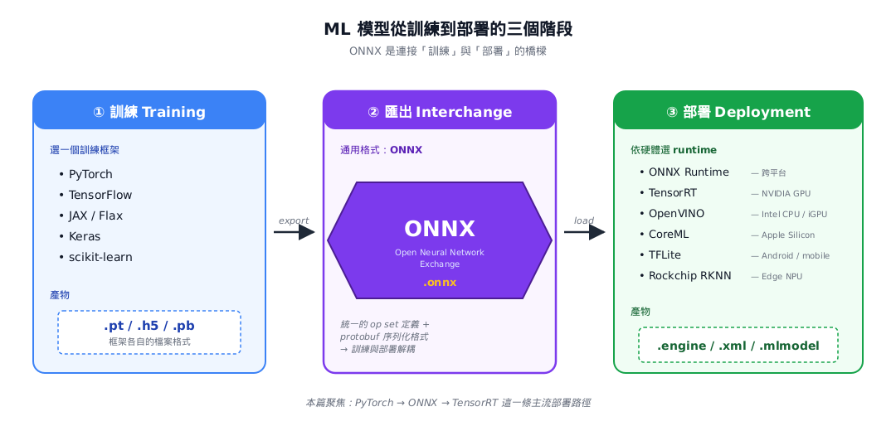
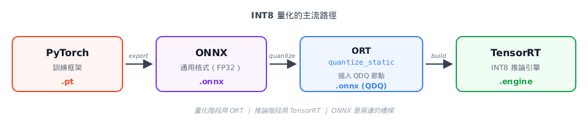
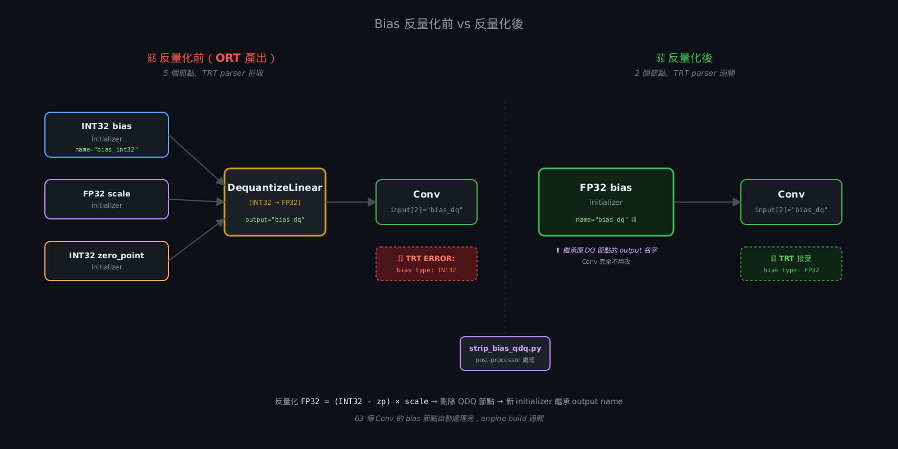

# 為什麼 model 越大反而越慢? 從 ORT 到 modelopt 的 INT8 量化的踩坑日誌

## 前言

INT8 量化在網路上的教學都說能快 4 倍。我原本也想跟著教學走一次，把 yolov8 推論速度拉起來、順便把這條主流的優化 pipeline 掌握下來。實測完全不是這樣。用 ONNX Runtime 的 `quantize_static` 走完主流路徑，yolov8n 勉強比 FP32 快一點，但輸給 FP16。換成更大的 yolov8m、INT8 engine 更是比 FP32 還慢 20%。**量化以後 model 越大反而越慢** 的反直覺結果，使我必須將 layer 的 profile 撈出來看到底怎麼回事。這篇是這段 debug 過程的完整紀錄：從 ORT 的三個坑（TensorRT 不接受非對稱量化、bias INT32 格式問題、fusion 失敗導致變慢），到換 NVIDIA 官方的 modelopt 才真正把 fusion 修乾淨，最後跑遍 yolov8n / m / x 三個 size，用實測解釋 **INT8 到底如何加速**。

## 1. ONNX Runtime PTQ

### ONNX & ORT 介紹
現在用來執行 ML 的 framework 十分的多，常見的有 PyTorch, TensorFlow, Scikit-learn 等等。但每個 framework 都各自有的儲存格式，以上述的例子來說則分別對應到 .pt, .h5, .joblib，多個 framework 之間的 model 是無法互通的，這導致了在 A 環境訓練出來的 model 在 B 環境中是完全無法做使用的。

為了解決上述的問題，Microsoft 和 Facebook (現 Meta) 等團隊聯合開發出了一種專門儲存 ML 的通用格式，ONNX (Open Neural Network Exchange)。而隨後 Microsoft 又研發了專門執行 ONNX 的 runtime，ORT (ONNX Runtime)。ORT 除了作為推論引擎，還提供了一套完整的**量化工具鏈**（`onnxruntime.quantization`），
能把 FP32 ONNX 轉成加了 QDQ 節點的量化 ONNX——這也是本篇會用到的功能。


### PTQ
ORT 有提供一種名為 PTQ (Post-Training Quantization) 的優化 model 的量化技術，通過將 model 的 weight 和 activation 的精度從高精度的 FP32 (4 bytes) 轉換成低精度的 INT8 (1 byte)，來達成 model 的容量減少便於 Edge 端部署以及增加 GPU 記憶體一次性能投餵的資料來達成加快推理速度的效果。INT8 相比於 FP32 能更快的執行推理主要原因是**記憶體受限 (Memory-Bound)**。過去幾年 GPU 的算力提升了數十倍，但記憶體的頻寬卻只單單增加了幾倍，這種硬體進步速度的差距，導致 GPU 大部分的運算瓶頸都在 Memory-Bound。量化可以讓佔據 4 bytes 的 FP32 轉化成佔據 1 byte 的 INT8，使得同樣的頻寬下可以搬運四倍的資料。


## 2. 跟隨主流的方法量化
前面的理論說完，是時候正式跑一遍流程了

**硬體 & 模型**：
- GPU：RTX 4070
- 環境：WSL2 Ubuntu 22.04 + CUDA 12.6 + TensorRT 10
- Model：YOLOv8n
- Baseline：FP32 engine 已 build 完成，pure inference 3-5 ms

**主要流程**：


我以這個流程為出發點撰寫了 [quantize_int8.py](https://github.com/ScORpioET/ai-learning-log/blob/main/Day3/quantize_int8.py) (完整檔在 GitHub)，架構十分單純，讀 FP32 的 ONNX，餵 calibration 圖，最後產出帶有 QDQ 節點的 INT8 的 ONNX。這裡挑程式比較重要的地方細講一下。


**Calibration 選取同域 datasets**
```python
class TrafficCalibrationReader(CalibrationDataReader):
    def __init__(self, calibration_dir, input_name):
        self.image_paths = sorted(glob.glob(...))
```
校正的目的是讓 `quantize_static` 統計 model 在**真實 deployment 資料**上
activation 的分布範圍，才能反算出對應的 scale——把 FP32 的動態範圍壓進 INT8
的 256 個離散值。如果拿了非同域的資料，這時反算出來的 scale 會有所偏離，實際推論時可能 activation 很有可能會被截斷或者是擠在某一些特定 INT8 區域導致，精度直接崩壞。

**Preprocess 必須跟 inference 時完全一致**
```
def preprocess(frame_bgr):
    frame_rgb = cv2.cvtColor(frame_bgr, cv2.COLOR_BGR2RGB)
    resized = cv2.resize(frame_rgb, (640, 640))
    transposed = resized.transpose((2, 0, 1))              # HWC → CHW
    normalized = transposed.astype(np.float32) / 255.0     # [0, 255] → [0, 1]
    return normalized[np.newaxis, :]                       # add batch dim → (1, 3, 640, 640)
```
calibration 的目的是統計 activation 在真實輸入上的分布，反算出 INT8 的 scale。如果 calibration 時的 preprocess 跟 inference 時不一致，calibration 算出來的 scale 對應的是「錯的 activation 分布」。真正 inference 時 activation 會落在意想不到的區間，被截斷或擠在少數幾格 INT8 值上，精度一樣會直接崩壞。


**選對稱量化 + 專屬 QDQ pair**：
```
quantize_static(
    model_input=PRE_PROCESSED,
    model_output=INT8_ONNX,
    calibration_data_reader=reader,
    quant_format=QuantFormat.QDQ,
    activation_type=QuantType.QInt8,
    weight_type=QuantType.QInt8,
    calibrate_method=CalibrationMethod.MinMax,
    per_channel=False,
    op_types_to_quantize=['Conv', 'MatMul'],    
    extra_options={
        'ActivationSymmetric': True,
        'WeightSymmetric': True,
        'DedicatedQDQPair': True,             
    },
)
```
quantize_static 是 ORT 提供的 PTQ API。參數大致能分成三類：

① 量化格式

`quant_format=QDQ`：產出 TensorRT 能接受的 QDQ 格式。

`activation`/`weight_type`：activation 和 weight 都量化到 INT8。

② 校準策略

`calibrate_method=MinMax`：走完 calibration data、記錄每個 tensor 的最大最小值，用這個範圍算 scale。另外還有 `Entropy` 和 `Percentile` 等選項可以視資料分布選擇。

③ 量化範圍

`op_types_to_quantize=['Conv', 'MatMul']`：`Conv`/`MatMul` 是矩陣乘法，時間複雜度會來到 O(N<sup>3</sup>)，是計算量吃最重的部分，而且如果把所有東西都量化會破壞 fusion，導致整體變得更慢，則後面會再提起。


## 3. 踩坑 (附解決方案)

### A. TensorRT 不接受非對稱量化

```
ERROR parsing ONNX:
In node 0 with name: images_QuantizeLinear and operator: QuantizeLinear 
(QuantDequantLinearHelper): INVALID_NODE: Assertion failed: 
shiftIsAllZeros(zeroPoint): Non-zero zero point is not supported. 
Please set kENABLE_UINT8_AND_ASYMMETRIC_QUANTIZATION_DLA to enable 
asymmetric quantization if it is on DLA.
```


對稱量化是指量化以後，FP32 的 0 會剛好對應到 INT8 的 0。但是 ORT 預設的量化方法是非對稱量化，公式如下：

```
FP32 = (INT8 − zero_point) × scale
```

從 `Non-zero zero point is not supported.` 這個錯誤訊息可得知 TensorRT 只接受對稱的量化 (Jetson DLA 除外)，也就是必須 `zero_point = 0`。解決方案是在 quantize_static 執行的時候通知 ORT 使用對稱的，只要在 extra_options 添加了 `ActivationSymmetric=True`、`WeightSymmetric=True` 就可以了。

### B. 不接受 INT32 格式

```
[TRT] ERROR: bias tensor of Conv node has unsupported type: INT32
[TRT] ERROR: expected FP32
```
前面的文章都在提 INT8 和 FP32 的轉化，為甚麼突然在這邊遇到了一個 INT32 呢?
我們簡單先來回顧一下 Conv 的計算 `output = Σ(W · X) + bias`。在這個時侯 W(Weight) 和 X(activation) 都已經被量化到 INT8 ，INT8 × INT8 一次的結果是 INT16、但 Conv 要累加 K×K×C 次（例如 3×3×256 = 2304 次），INT16 加 2304 次會直接爆掉、所以硬體最後選擇了 INT32 accumulator，而 bias 也必須配合硬體所以也換成了 INT32。

那為甚麼 bias 的需求是 FP32 呢，這就要講到 Tensor Core。Tensor Core 是 NVIDIA 專為矩陣運算加速的硬體處理單元，其中有一項特性就是混合精度運算 (輸入作為低精度的 INT8，而輸出結果做成 FP32，也稱作 IMMA, Integer Matrix Multiply-Accumulate)。再來回頭看剛剛的公式 `output = Σ(W · X) + bias`，會發現輸入就是 INT8(W) * INT8(X)，FP32(output) 作為輸出，剛好完美對上了 IMMA。TensorRT 希望能拿到純正的 FP32 bias 原因是一來量化會把精度給 round 掉，二來是 output 本來就決定會是 FP32，改精度這個動作就有點多此一舉。但是 ORT 在量化的過程就把 bias 變成了 INT32，導致爆出了上述的錯誤。

這篇的解決方案則是撰寫了 [strip_bias_qdq.py](https://github.com/ScORpioET/ai-learning-log/blob/main/Day3/strip_bias_qdq.py)，邏輯上就做三件事：找 bias DQ 節點 → 反量化回 FP32 → 剝掉 QDQ 節點、換成 FP32 initializer。完成以後就可以成功把 .ONNX 轉化成 .engine。




### C. 量化後反而速度更慢

我自寫了一個 Benchmark 來看量化以後的變化。[profile_engine.py](https://github.com/ScORpioET/ai-learning-log/blob/main/Day3/profile_engine.py)，程式的重點就是透過繼承 `trt.IProfiler` 實作 `report_layer_time(layer_name, ms)`，context 每執行一次就會告訴我每個 layer 的耗時。


**yolov8n**（RTX 4070, 1280×720 input）

| Benchmark | FP32 | FP16 | INT8 (ORT) |
|---|---|---|---|
| Total time (ms, median) | 3.388 | **2.271** | 2.473 |
| Layer count | 256 | 171 | 162 |
| QDQ_standalone (count / ms) | 0 / 0 | 0 / 0 | **49 / 0.673** |

**yolov8m**（RTX 4070, 1280×720 input）

| Benchmark | FP32 | FP16 | INT8 (ORT) |
|---|---|---|---|
| Total time (ms, median) | 6.326 | **3.622** | **7.640** ⚠️ |
| Layer count | 328 | 228 | 477 |
| QDQ_standalone (count / ms) | 0 / 0 | 0 / 0 | **120 / 2.153** |

理論上來講量化完成以後，推論速度應該要快上 4 倍。這裡分別在較小的 yolov8n 和較大的 yolov8m 進行 Benchmark 的測試。由表格得知雖然 yolov8n 確實比 FP32 還要更加快速，但是速度卻比 FP16 還要慢，而在 yolov8m 的時候還成為速度最慢的。而且量化以後的 Layer 應該都因為 fuse 而層數變更少，但 yolov8m 卻變得更多了。


**yolov8m Category breakdown（FP32 vs INT8）**

| Category | FP32 count | FP32 ms | INT8 count | INT8 ms |
|---|---:|---:|---:|---:|
| ConvFused | 81 | 4.578 | 166 | 3.280 |
| QDQ_standalone | 0 | 0 | **120** | **2.153** ⚠️ |
| Reformatting | 106 | 0.305 | 74 | 0.279 |
| Activation | 1 | 0.035 | 1 | 0.037 |
| Other | 140 | 1.408 | 116 | 1.634 |
| **Total** | **328** | **6.326** | **477** | **7.640** |

由這個表格可知道 ConvFused 時間變快了（4.58 → 3.28），但卻憑空冒出了許多獨立的 QDQ 沒有被 fuse 成 kernel 導致多出了 2.1 ms 的運算，我們加速的部分全部都被多出了的 120 個獨立 QDQ 給耗掉了。

```
Performance can decrease if TensorRT cannot fuse the operations with the surrounding Q/DQ layers, so be conservative when adding Q/DQ nodes and experiment with both accuracy and TensorRT performance in mind.

[TensorRT Quantized Types: Explicit Quantization](https://docs.nvidia.com/deeplearning/tensorrt/latest/inference-library/quantized-types-explicit-quantization.html)
```

TensorRT 官方 doc 明確警告如果 QDQ 沒有 fuse 將會導致效能的下降。我當時選 ORT 的不外乎就是，PyTorch model 反正要轉 ONNX 給 TensorRT，在 ORT 量化的教學文章也多，做起來也挺省事的。但走到這邊繼續解析和調整 ORT 已經不是理性選擇，與其花時間理解 TRT 的 fusion 行為、不如換 NVIDIA 官方推薦的量化工具 Modelopt。

## 4. Modelopt 量化

### Dynamo 查詢錯誤

```
config = mtq.INT8_DEFAULT_CFG
q_model = mtq.quantize(model, config, forward_loop)
# ...
torch.onnx.export(q_model, dummy, "yolov8m_int8_modelopt.onnx",
                  opset_version=17, dynamo=False)
```
相比 ORT 的 `quantize_static` 需要一大堆參數，Modelopt 就簡單很多了。不過需要注意的事情是 Modelopt 如果使用 Dynamo 的做法會直接報錯。PyTorch 的 Dynamo 有一個叫做 ONNX symbolic registration 的翻譯字典，這個字典用來把我的 model 對照成 ONNX，但 modelopt 在量化的時候會幫我們加一些 custom op，目前的字典看不懂這些 op，所以在量化的步驟時要把 `dynamo=False` 否則會導致

```
DispatchError: No ONNX function found for 
<OpOverload(op='tensorrt.quantize_op', overload='default')>. 
Failure message: No decompositions registered for the real-valued input
```


### yolov8 冒出了 6 個 output


完成量化後就可以直接測試用 [bench_trt.py](https://github.com/ScORpioET/ai-learning-log/blob/main/Day2/bench_trt.py) 來測試效能。雖然有跑出結果，但在測試途中意外發現 output 竟然多達 6 個。
```
Engine tensors:
  INPUT  images: shape=(1, 3, 640, 640) dtype=float32
  OUTPUT output0: shape=(1, 84, 8400) dtype=float32
  OUTPUT onnx::Reshape_1864: shape=(1, 64, 8400) dtype=float32
  OUTPUT onnx::Sigmoid_2007: shape=(1, 80, 8400) dtype=float32
  OUTPUT onnx::QuantizeLinear_1491: shape=(1, 192, 80, 80) dtype=float32
  OUTPUT onnx::QuantizeLinear_1605: shape=(1, 384, 40, 40) dtype=float32
  OUTPUT onnx::QuantizeLinear_1719: shape=(1, 576, 20, 20) dtype=float32
```

yolov8 的 output 理論上只有一個 (shape=(1, 84, 8400))，多出來的是 yolov8 的 detect module 在 eval 下， `forward()` 回傳的 tensor `(y, preds)`。`y=我們要的output` `preds= head（YOLOv8 的 detection head,負責產出 box 和 class）的原始輸出`。這樣會多出很多我們不需要的資料，輸出會變得很難閱讀也浪費記憶體空間。修法也並不困難， 只要在量化之前將 `forward()` 的回傳 `return y if self.export else (y, preds)` 的 `self.export = True` 就好了。

```
from ultralytics.nn.modules import Detect
for m in q_model.modules():
    if isinstance(m, Detect):
        m.export = True
```

這樣完成了我們量化程式的最終版本 [quantize_modelopt.py](https://github.com/ScORpioET/ai-learning-log/blob/main/Day4/quantize_modelopt.py)。這版本的 output 從 6 個縮減成正常的 1 個 `OUTPUT output0: shape=(1, 84, 8400) dtype=float32`，且 engine 的結構就會比較乾淨，下游比較可讀的同時記憶體又不會浪費。

### 在 yolov8n 上面速度依然輸給 FP16


量化完成，那透過 modelopt 跑起來是否真的有變快呢?依舊用 [bench_trt.py](https://github.com/ScORpioET/ai-learning-log/blob/main/Day2/bench_trt.py) 來對 yolov8n 和 yolov8m 進行一次效能測試。

**Benchmark 結果**（RTX 4070, pure inference, 640×640, FPS）

| Model   |  FP32 |  FP16 | INT8 (modelopt) | vs FP32 | vs FP16 |
| ------- | ----: | ----: | --------------: | ------: | ------: |
| yolov8n | 504.6 | **808.3** | 688.0       | +36%    | **−15%** |
| yolov8m | 184.5 | 381.1 | **400.3**       | +117%   | **+5%**  |

由表格可以看出，雖然 yolov8n 的結果和之前用 ORT 進行量化的結果是一樣贏 FP32 輸 FP16，但在更大模型的 yolov8m 可以看出不僅有贏 FP16，而且速度還是達到 FP32 的兩倍。不過這裡還是延伸出了兩個問題，第一是為甚麼速度不是理論上的四倍，就連最好的 yolov8m 也只有兩倍。第二是為甚麼量化後和 FP16 差距這麼小，在小模型 yolov8n 甚至效率不如 FP16。這就讓我思考著 INT8 到底是甚麼情況下會贏會輸?


## 5. memory-bound vs compute-bound

回到第一部分提過的 memory-bound，INT8 主要的加速來源分為兩個：

- **記憶體頻寬**：資料從 4 bytes 壓到 1 byte、同樣的 bandwidth 可以搬 4 倍的資料。
- **Tensor Core (IMMA)**：INT8 × INT8 的 matrix multiply 有專屬硬體加速，算是 FP32 的好幾倍。

雖然兩個相乘確實有機會逼近理論值 4 倍。但問題是量化不是零成本，每個 conv 的 input / output 都要付出 quantize / dequantize 的邊界成本，即使是全 fuse 還是會進行 layout 轉換和 scale 運算造成額外開銷。而且 Sigmoid, Softmax 等 activation functions 沒有 INT8 kernel 實作，engine 會保留原本的 type，所以這些非量化 op 的交界處也必須插入 Q/DQ。所以要能加速成功，必須要每層的 Conv 夠厚，Tensor Core 的收益能大於其餘的開銷。

- **yolov8n**：每層 Conv 太薄，所以邊界成本佔比高，導致加速收益很小。
- **yolov8m**：Conv 層計算量夠大，INT8 對 FP16 的加速成功 cover 過邊界成本。

為了驗證 model 愈大加速效果愈好，我用了 yolov8 當中最大的模型 yolov8x 測：

**Benchmark 結果**（RTX 4070, pure inference, 640×640, FPS）
| Model   |  FP32 |  FP16 |      INT8 | vs FP32 |  vs FP16 |
| ------- | ----: | ----: | --------: | ------: | -------: |
| yolov8n | 504.6 | 808.3 |     688.0 |    +36% |  **−15%** |
| yolov8m | 184.5 | 381.1 |     400.3 |   +117% |   **+5%** |
| yolov8x |  69.2 | 194.0 | **246.0** |   +256% |  **+27%** |

**−15% → +5% → +27%**。yolov8x 甚至反超 FP16 27%。所以可以看到當模型越大，Conv 越厚的時候加速效果就會變得更好。


## 6. 心得與通用手法
這篇從 ORT quantize_static 一路 debug 到 modelopt，加上最後的三個 model size 的 benchmark，最後的 takeaway 其實不只在量化至 INT8 本身，更多的是找出優化失敗的問題並加以解決。在網路上許多的教學文都敘述著可以快 4 倍以上，但一開始 ORT 實測跑下來，別說 4 倍了，根本還退步。之後從 ORT 換成 modelopt 以後，才成功的讓 Q/DQ 都有成功 fuse 進 Conv，達成了真正的體積縮小並加速的成果。


## 7. 未解問題 / 未來方向
這篇還留了幾個沒解完的問題、記下來給未來的自己追。

**沒 benchmark 精度**：整篇都在講速度，完全沒測 INT8 量化後 mAP 掉了多少。下一步要跑 COCO val set 對三個精度做 mAP 對比，看看 modelopt PTQ 到底損失多少。如果精度掉太多、可能還得再上 QAT (Quantization Aware Training)。

**Compute-bound 的極限**：yolov8x 已經是 yolo 家族最大，期盼之後換更大的 model（例如 RT-DETR-x、DINO），INT8 對 FP16 的加速比會繼續擴大、還是有 diminishing return？

**Jetson / DLA 場景**：所有 benchmark 都在 RTX 4070 上跑。搬到 Jetson Orin 上，DLA 只吃 INT8 / FP16、pattern 的狀況會完全不一樣。Jetson 上 INT8 甚至可能不是 **加速的選項** 而是 **成功運算的條件**。
