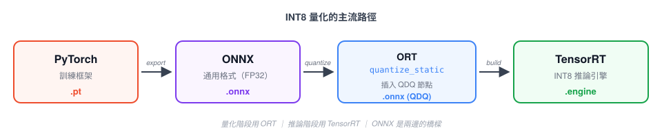

# TensorRT的採坑日誌：INT8比FP32推理速度慢

<!-- 目標總長 3500-4500 字，分 3 天寫 -->

## 前言
<!-- Day 1 待寫 200-300 字 -->
<!-- Hook：INT8 該快 4 倍，我實際慢 3 倍 -->
<!-- Jack 是誰、為什麼寫、硬體環境、賣點預告 -->


## 1. ONNX Runtime PTQ
<!-- Day 1 待寫 600-800 字 -->
<!-- 主流路徑 / 坑 1 zero_point / 坑 2 bias Int32 / 坑 3 慢 3 倍（★） -->
<!-- 收尾：工程 ROI → 換 modelopt -->
### ONNX & ORT介紹
現在用來執行ML的framework十分的多，常見的有PyTorch, Tensorflow, Scikit-learn等等。但每個framework都有自己各自的儲存格式，已上述的例子來說則分別對應到.pt, .h5, .joblib，多個framework之間的model是無法互通的，這導致了在A環境訓練出來的model在B環境中是完全無法做使用的。

為了解決上述的問題，Microsoft和Facebook(現 Meta)等團隊聯合開發出了一種專門儲存ML的通用格式，ONNX (Open Neural Network Exchange)。而隨後Microsoft又研發了專門執行ONNX的runtime，ORT (ONNX Runtime)。ORT 除了作為推論引擎，還提供了一套完整的**量化工具鏈**（`onnxruntime.quantization`），
能把 FP32 ONNX 轉成加了 QDQ 節點的量化 ONNX——這也是本篇會用到的功能。


### PTQ
ORT有提供一種名為PTQ(Post-Training Quantization)的優化model的量化技術，通過將model的weight和activation的精度從高精度的FP32(4 bytes)傳換成低精度的INT8(1 byte)，來達成model的容量減少便於Edge端部屬以及增加GPU記憶體一次性能投餵的資料來達成加快推理速度的效果。INT8相比於FP32能更快的執行推理主要原因是**記憶體受限 (Memory-Bound)**。過去幾年GPU的算力提升了數十倍，但記憶體的頻寬卻只單單增加了幾倍，這種硬替進步速度的差距，導致GPU大部分的運算瓶頸都在Memory-Bound。量化可以讓佔據4 bytes的FP32轉化成佔據1 byte的INT8，使得同樣的頻寬下可以搬運四倍的資料。


## 2. 跟隨主流的方法量化
前面的理論說完，是時候正是跑一遍流程了

**硬體 & 模型**：
- GPU：RTX 4070
- 環境：WSL2 Ubuntu 22.04 + CUDA 12.6 + TensorRT 10
- Model：YOLOv8n
- Baseline：FP32 engine 已 build 完成，pure inference 3-5 ms

**主要流程**：


我以這個流程為出發點撰寫了[quantize_int8.py](https://github.com/ScORpioET/ai-learning-log/blob/main/Day3/quantize_int8.py)(完整檔在 GitHub)，架構十分單純，讀FP32的ONNX，餵calibration圖，最後產出帶有QDQ節點的INT8的ONNX。這裡挑程式比較重要的地方戲講一下。


**Calibration 選取同域datasets**
```python
class TrafficCalibrationReader(CalibrationDataReader):
    def __init__(self, calibration_dir, input_name):
        self.image_paths = sorted(glob.glob(...))
```
校正的目的是讓 `quantize_static` 統計 model 在**真實 deployment 資料**上
activation 的分布範圍，才能反算出對應的 scale——把 FP32 的動態範圍壓進 INT8
的 256 個離散值。如果拿了非同域的資料，這是反算出來的scale會有所偏離，實際推論時可能activation很有可能會被截斷或者是擠在某一些特定INT8區域導致，精度直接崩壞。

**Preprocess 必須跟 inference 時完全一致**
```
def preprocess(frame_bgr):
    frame_rgb = cv2.cvtColor(frame_bgr, cv2.COLOR_BGR2RGB)
    resized = cv2.resize(frame_rgb, (640, 640))
    transposed = resized.transpose((2, 0, 1))              # HWC → CHW
    normalized = transposed.astype(np.float32) / 255.0     # [0, 255] → [0, 1]
    return normalized[np.newaxis, :]                       # add batch dim → (1, 3, 640, 640)
```
calibration的目的是統計activation在真實輸入上的分布，反算出INT8的scale。如果 calibration 時的 preprocess 跟 inference 時不一致，calibration 算出來的 scale 對應的是「錯的 activation 分布」。真正 inference 時 activation 會落在意想不到的區間，被截斷或擠在少數幾格 INT8 值上，精度一樣會直接崩壞。


**選對稱量化 + 專屬 QDQ pair**：
```
quantize_static(
    model_input=PRE_PROCESSED,
    model_output=INT8_ONNX,
    calibration_data_reader=reader,
    quant_format=QuantFormat.QDQ,
    activation_type=QuantType.QInt8,
    weight_type=QuantType.QInt8,
    calibrate_method=CalibrationMethod.MinMax,
    per_channel=False,
    op_types_to_quantize=['Conv', 'MatMul'],    
    extra_options={
        'ActivationSymmetric': True,
        'WeightSymmetric': True,
        'DedicatedQDQPair': True,             
    },
)
```
`ActivationSymmetric=True`、`WeightSymmetric=True`、`DedicatedQDQPair=True`

TensorRT GPU 只吃對稱（`zero_point=0`），ORT 預設是非對稱要手動改；`DedicatedQDQPair` 則是強迫每個下游 Conv 拿到專屬的 Q/DQ、不共享。
## 2. 換 toolkit：nvidia-modelopt 的環境地獄
<!-- Day 2 待寫 600-800 字 -->
<!-- pytorch-quant 已死 / dynamo exporter / CUDA 三層 / nvcc C++20 -->


## 3. modelopt 跑起來：贏 FP32 但輸 FP16
<!-- Day 2 待寫 500-600 字 -->
<!-- 第一次 benchmark / 假設 1 output leak / 修完 FPS 沒動 -->


## 4. 換假設：memory-bound vs compute-bound
<!-- Day 3 待寫 500-600 字 -->
<!-- 假設 2 / 換 yolov8m 驗證 / 完整表格 / RTX 4070 沒 DLA -->


## 5. 心得與通用手法
<!-- Day 3 待寫 500-600 字 -->
<!-- 4 個 takeaway / 通用 debug 手法 -->


## 6. 未解問題 / 未來方向
<!-- Day 3 待寫 200-300 字 -->
